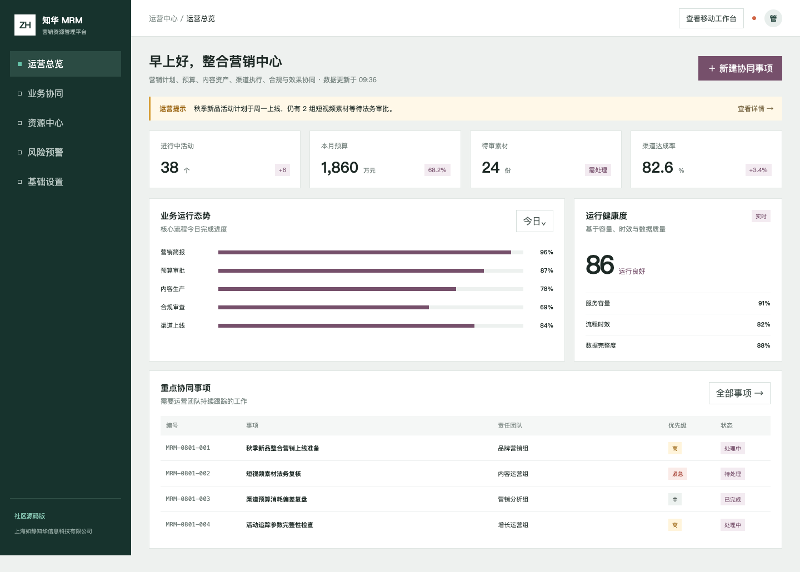
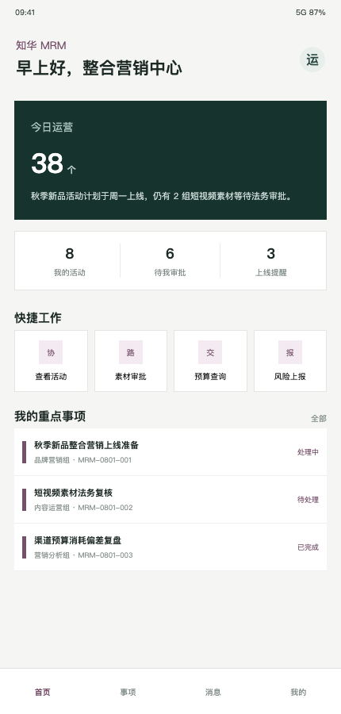

<div align="center">

# ZhuaTech MRM

## 知华营销资源管理平台 · 社区源码版

让营销简报、预算、内容资产、合规审批、渠道上线与效果协同保持在同一节奏

[官方网站](https://www.zhuatech.cn/) · [页面实录](#页面实录) · [场景说明](#场景说明) · [启动指南](#启动指南) · [联系知华](#联系知华)

</div>

> Copyright © 2026 上海如静知华信息科技有限公司。仅限个人非商业学习交流；未经书面授权，不得商用或用于企业内部生产。

## 页面实录

### 品牌与营销运营管理端



管理端用活动、预算、素材审批、渠道达成率和阶段进度还原整合营销团队的日常视角，重点事项保留责任团队、优先级与状态。

### 营销人员移动工作台



H5 将查看活动、素材审批、预算查询和风险上报放在首屏，也可继续扩展拍摄任务、渠道验收与现场执行签到。

## 场景说明

一次营销活动上线前，常见信息分散在项目工具、网盘、预算表和聊天记录中。ZhuaTech MRM 首版提供一条明确的准备链路：

1. 完成营销简报与受众准备。
2. 形成内容资产并跟踪完整度。
3. 取得预算与法务批准。
4. 完成渠道配置和追踪参数。
5. 通过活动就绪度接口检查阻断项。

活动接口综合六项准备度形成分数，并给出 `READY / REVIEW / BLOCKED`。它是软件规则样例，不替代企业法务、品牌、财务或广告合规判断。

## 工程能力卡

| 端 | 核心能力 | 技术实现 |
| --- | --- | --- |
| 管理端 | 活动态势、阶段进度、素材/预算/渠道事项 | Vue 3 + Vite |
| 移动端 | 活动查看、素材审批、预算查询、风险上报 | 响应式 H5 |
| 服务端 | 活动就绪度、运营风险、任务聚合、角色鉴权 | Java 21 + Spring Boot 4 |
| 数据层 | JPA 领域实体、MySQL 生产配置、H2 测试 | Spring Data JPA |

后端业务包为 `cn.zhuatech.mrm`。文档入口：[API](docs/API.md) / [架构](docs/ARCHITECTURE.md) / [更新记录](CHANGELOG.md)。

## 启动指南

Docker 方式：

```bash
cp .env.example .env
docker compose up --build
```

访问 `http://localhost:8090`，本地账号为 `admin / admin123` 和 `operator / operator123`。默认凭据不得用于公开网络或生产环境。

源码方式：

```bash
cd backend && mvn spring-boot:run
cd frontend && npm install && npm run dev
```

## 使用许可

**ZhuaTech Community Source License 1.0（个人非商业版）**允许个人学习、研究、技术交流及非商业修改，但不允许企业生产、商业部署、SaaS、收费下载、咨询实施、培训、外包、投标、品牌替换或其他获利使用。本项目因此不是 OSI 认可的开源软件。完整条款见 [LICENSE](LICENSE)。

## 联系知华

商业授权、企业私有化部署、营销平台深度定制和系统集成，请联系知华科技（上海如静知华信息科技有限公司）。

- 官网：[https://www.zhuatech.cn/](https://www.zhuatech.cn/)
- 微信咨询：任选下方二维码扫码添加。

<p align="center">&nbsp;&nbsp;&nbsp;&nbsp;</p>

仓库只使用虚构演示数据。请勿提交客户素材、未发布活动、个人信息、商业合同、访问令牌或生产凭据；协作与安全要求见 [CONTRIBUTING.md](CONTRIBUTING.md) 和 [SECURITY.md](SECURITY.md)。

关键词：知华科技 MRM、营销资源管理系统、营销预算管理、内容资产管理、营销活动管理、Java MRM、Spring Boot 营销平台、Vue 管理系统、上海软件开发。
